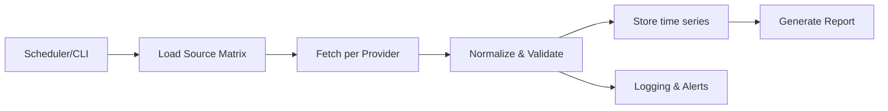

# PRD (Product Requirements Document)

## 0) Begriffsklärung

* **PRD**: Product Requirements Document. Anforderungen + Scope.
* **PoC**: Proof of Concept. Kleiner, funktionierender Erstaufbau.
* **LLM**: Large Language Model. Interpretiert Daten, holt sie aber nicht ab.

## 1) Problem

Wir wollen täglich Makro-/Marktdaten abholen (z. B. Inflation, Geldmenge, Indizes, Krypto, Liquidität). Daraus soll ein Report entstehen.

Probleme heute:

* Zu viele Datenquellen, unterschiedliche APIs.
* Datenreihen können verschwinden/umbenannt werden.
* Ohne Logging/Alerts fällt das spät auf.
* Daten müssen sauber normalisiert sein (Frequenz, Zeitzonen, Währung, Revisionslogik).

## 2) Zielbild

Ein lokales Python-PoC, das:

* Daten über eine **Data-Source-Matrix** verwaltet.
* Täglich **Daily Close** (EOD = End of Day) abholt.
* Auf Knopfdruck einzelne Reihen aktualisiert.
* Änderungen/Fehler robust **loggt** (inkl. „Series missing“).
* Eine stabile lokale Datenbasis erzeugt.
* Einen ersten, strukturierten „Makro-Report“ generiert (LLM liest nur die Resultate).

## 3) Nicht-Ziele (PoC)

* Kein Web-Frontend.
* Kein Multi-User, kein Auth.
* Kein perfektes Forecasting.
* Keine vollständige Weltabdeckung (Japan/China optional als Erweiterung).

## 4) Nutzer und Use-Cases

Primärer Nutzer: du (lokal, technisch).

Use-Cases:

1. **Daily Run**: „Hole alle Daily-Close-Reihen und speichere“.
2. **On-Demand**: „Update nur BTC, SPX, M2“.
3. **Quality Check**: „Welche Reihen fehlen/liefern seit X Tagen keine Daten?“.
4. **Report**: „Erzeuge Tagesreport + Delta vs. Vortag/Woche/Monat“.

## 5) Annahmen

* Startquellen: **FRED API** (Makro), **Yahoo Finance** (Markets/Krypto) als PoC.
* Yahoo kann instabil sein (inoffiziell). Im PoC akzeptiert. Später Ersatz via offizielle Anbieter.
* Storage lokal: Parquet/CSV + optional SQLite-Datenbank.

## 6) Scope v1 (PoC)

### 6.1 Datenkategorien (initial)

* **Makro USA**: CPI (Consumer Price Index), PCE, Arbeitsmarkt, ISM/PMI, M2, Fed Funds, Treasury Yields.
* **Liquidität**: TGA (Treasury General Account) soweit verfügbar; ggf. später ergänzen.
* **Risk Assets**: S&P 500, Nasdaq 100, VIX, HY Spreads (High Yield), DXY (US Dollar Index) optional.
* **Commodities**: Öl, Gold.
* **Krypto**: BTC, ETH.

### 6.2 Data-Source-Matrix (Pflicht)

Eine Tabelle/Datei (YAML/CSV/JSON), die jede Serie beschreibt:

* `id` (intern)
* `provider` (fred, yfinance, …)
* `provider_symbol` (z. B. FRED series id, Yahoo ticker)
* `category`
* `frequency_target` (daily)
* `timezone`
* `units` (%, index, USD, …)
* `transform` (none, pct_change, log, …)
* `notes`
* `enabled`
* `last_ok` (wird vom System gepflegt)
* `status` (ok/warn/error/missing)

### 6.3 Kernfunktionen

* **Ingestion** (Abholen): pro Provider ein Adapter.
* **Normalize**: Datum, Zeitzone, NaNs, Dedupe, Sort.
* **Store**: Append-only Zeitreihe pro Serie.
* **Detect & Log**:

  * Missing series.
  * Leere Antwort.
  * Provider Fehler.
  * „Stale data“ (seit N Tagen unverändert).
* **Report v1**:

  * Tabelle: letzter Wert, Δ1d/Δ5d/Δ21d.
  * Flags: Risk-On/Off Heuristiken (simple Regeln).
  * Export: Markdown + JSON.

## 7) Architektur (PoC)

### 7.1 Komponenten

* `config/` (API Keys, Pfade, Matrix)
* `sources/` (Provider-Adapter)
* `pipeline/` (fetch → normalize → store → validate)
* `storage/` (Parquet/CSV/SQLite)
* `report/` (aggregieren, deltas, output)
* `logs/` (structured logs + run summary)

### 7.2 Ablauf

## 8) Requirements

### 8.1 Functional Requirements

FR1: Daily Run holt alle `enabled=true` Serien.
FR2: On-Demand Run holt eine Liste von `id`s.
FR3: Jede Serie wird als Zeitreihe gespeichert (append, kein overwrite ohne Log).
FR4: Validation markiert `status` (ok/warn/error/missing).
FR5: Run Summary: Anzahl ok/warn/error/missing + Laufzeit.
FR6: Report wird als `report.md` + `report.json` erzeugt.

### 8.2 Non-Functional Requirements

NFR1: Reproduzierbar (lockfile, requirements).
NFR2: Deterministische Outputs bei gleichem Input.
NFR3: Robust gegen API-Ausfälle (Retries, Timeouts, Backoff).
NFR4: Logging strukturiert (JSON logs).
NFR5: Keine Secrets in Git.

## 9) Datenqualität und Edge-Cases

* Revisionsdaten (v. a. FRED) können rückwirkend ändern.

  * PoC: „overwrite per date“ zulassen, aber revision loggen.
* Unterschiedliche Handelskalender.

  * PoC: Daily index, fehlende Tage als NaN, Deltas nur auf verfügbare Punkte.
* Yahoo-Delist/Rate-Limits.

  * PoC: fallback = status warn/error, kein Crash.

## 10) Akzeptanzkriterien (PoC)

* Ein Befehl erzeugt lokal:

  * `data/` mit mind. 15 Serien, jeweils > 2 Jahre Historie (wo verfügbar).
  * `logs/run-YYYYMMDD.jsonl`.
  * `reports/report-YYYYMMDD.md` und `.json`.
* Ein zweiter Lauf am selben Tag:

  * schreibt keine Duplikate.
  * zeigt im Summary „0 neue Punkte“ oder nur die echten Updates.
* Wenn eine Serie nicht mehr verfügbar ist:

  * Status `missing`.
  * Logeintrag inkl. Serien-ID.

## 11) Roadmap

### Milestone M0: Repo + Skeleton

* Ordnerstruktur, CLI, Config laden.

### M1: Provider Adapter

* FRED Adapter.
* Yahoo Finance Adapter.

### M2: Pipeline + Storage

* Normalize + Validate.
* Storage (Parquet bevorzugt).

### M3: Report v1

* Deltas + Flags.
* Markdown + JSON Export.

### M4: Monitoring

* Stale-series detection.
* „Matrix status“ export.

## 12) TODO für RooCode (direkt übernehmbar)

### Epic 1: Repo Setup

* [ ] Python-Projekt initialisieren (pyproject.toml, uv/poetry).
* [ ] CLI via `typer` oder `argparse`.
* [ ] Konfig-Handling: `.env` + `config.yaml`.
* [ ] Structured Logging (jsonlines).

### Epic 2: Data-Source-Matrix

* [ ] `sources_matrix.yaml` Schema definieren.
* [ ] Loader + Schema-Validation (pydantic).
* [ ] Status-Felder automatisch pflegen (`last_ok`, `status`).

### Epic 3: Provider Adapter

* [ ] FRED: fetch series by id, support start/end.
* [ ] Yahoo Finance: fetch EOD close for tickers.
* [ ] Retry/Timeout/Backoff (tenacity).

### Epic 4: Normalize/Validate

* [ ] Einheitliches Datumsformat (UTC oder Europe/Vienna klar definieren).
* [ ] Dedupe + sort + gap handling.
* [ ] Validations: empty, stale, missing.

### Epic 5: Storage

* [ ] Time series pro Serie als Parquet (Partition by series id).
* [ ] Append/merge logic ohne Duplikate.
* [ ] Optional: SQLite index für Metadaten.

### Epic 6: Report v1

* [ ] Aggregator: last value + Δ1d/5d/21d.
* [ ] Risk Flags (simple rules): z. B. VIX↑ + HY spread↑ = Risk-Off.
* [ ] Output: Markdown + JSON.

### Epic 7: DX (Developer Experience)

* [ ] Makefile/justfile: `run_all`, `run_one`, `report`.
* [ ] Minimal Tests (pytest) für Matrix-Loader + storage merge.
* [ ] Beispielkonfig + Dokumentation.

## 13) Open Questions (für später, nicht blocker für PoC)

* Offizieller Ersatz für Yahoo (kostenlos/bezahlt) und Prioritäten.
* Japan/China Daten: welche Reihen sind must-have?
* Dot Plots / Fed Outlook: Quelle + Extraktionsweg (PDF/HTML parsing) – eigener Adapter.
