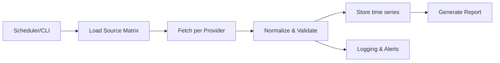

# PRD (Product Requirements Document)

## 0) Begriffsklärung

* **PRD**: Product Requirements Document. Anforderungen + Scope.
* **PoC**: Proof of Concept. Kleiner, funktionierender Erstaufbau.
* **LLM**: Large Language Model. Interpretiert Daten, holt sie aber nicht ab.

## 1) Problem

Wir wollen täglich Makro-/Marktdaten abholen (z. B. Inflation, Geldmenge, Indizes, Krypto, Liquidität). Daraus soll ein Report entstehen.

Probleme heute:

* Zu viele Datenquellen, unterschiedliche APIs.
* Datenreihen können verschwinden/umbenannt werden.
* Ohne Logging/Alerts fällt das spät auf.
* Daten müssen sauber normalisiert sein (Frequenz, Zeitzonen, Währung, Revisionslogik).

## 2) Zielbild

Ein lokales Python-PoC, das:

* Daten über eine **Data-Source-Matrix** verwaltet.
* Täglich **Daily Close** (EOD = End of Day) abholt.
* Auf Knopfdruck einzelne Reihen aktualisiert.
* Änderungen/Fehler robust **loggt** (inkl. „Series missing“).
* Eine stabile lokale Datenbasis erzeugt.
* Einen ersten, strukturierten „Makro-Report“ generiert (LLM liest nur die Resultate).

## 3) Nicht-Ziele (PoC)

* Kein Web-Frontend.
* Kein Multi-User, kein Auth.
* Kein perfektes Forecasting.
* Keine vollständige Weltabdeckung (Japan/China optional als Erweiterung).

## 4) Nutzer und Use-Cases

Primärer Nutzer: du (lokal, technisch).

Use-Cases:

1. **Daily Run**: „Hole alle Daily-Close-Reihen und speichere“.
2. **On-Demand**: „Update nur BTC, SPX, M2“.
3. **Quality Check**: „Welche Reihen fehlen/liefern seit X Tagen keine Daten?“.
4. **Report**: „Erzeuge Tagesreport + Delta vs. Vortag/Woche/Monat“.

## 5) Annahmen

* Startquellen: **FRED API** (Makro), **Yahoo Finance** (Markets/Krypto) als PoC.
* Yahoo kann instabil sein (inoffiziell). Im PoC akzeptiert. Später Ersatz via offizielle Anbieter.
* Storage lokal: Parquet/CSV + optional SQLite-Datenbank.

## 6) Scope v1 (PoC)

### 6.1 Datenkategorien (initial)

* **Makro USA**: CPI (Consumer Price Index), PCE, Arbeitsmarkt, ISM/PMI, M2, Fed Funds, Treasury Yields.
* **Liquidität**: TGA (Treasury General Account) soweit verfügbar; ggf. später ergänzen.
* **Risk Assets**: S&P 500, Nasdaq 100, VIX, HY Spreads (High Yield), DXY (US Dollar Index) optional.
* **Commodities**: Öl, Gold.
* **Krypto**: BTC, ETH.

### 6.2 Data-Source-Matrix (Pflicht)

Eine Tabelle/Datei (YAML/CSV/JSON), die jede Serie beschreibt:

* `id` (intern)
* `provider` (fred, yfinance)
* `provider_symbol` (z. B. FRED series id, Yahoo ticker)
* `category`
* `frequency_target` (Default: daily)
* `stale_days` (optionaler Override für Staleness-Check)
* `timezone` (Default: UTC)
* `units`
* `transform` (none, pct_change, log, …)
* `notes`
* `enabled` (Default: true)
* `last_ok` (wird vom System gepflegt)
* `status` (ok/warn/error/missing)

### 6.3 Kernfunktionen

* **Ingestion** (Abholen): pro Provider ein Adapter.
  * EOD ist provider-abhängig.
  * Storage erfolgt in UTC; Reporting-TZ wird separat berechnet.
* **Normalize**: Datum, Zeitzone, NaNs, Dedupe, Sort.
  * **Data Contract**: Siehe aktuelle Definition in [`README.md`](../README.md:137).
* **Store**: Append-only Zeitreihe pro Serie.
  * **Idempotenz & Revisions**: Upsert pro (date, series_id) ist NUR bei Revisionen erlaubt.
  * Jede Änderung erzeugt ein `revision_log` Event.
* **Detect & Log**:
  * **Standard Error Codes**: `MISSING_SERIES`, `EMPTY_RESPONSE`, `RATE_LIMIT`, `NETWORK_TIMEOUT`, `PARSE_ERROR`.
  * **Stale Detection**: Thresholds quantifiziert (z. B. Markets: 3–5 Tage; Macro: frequenzabhängig, z. B. Monthly -> 45 Tage).
* **Report v1**:
  * **Split Logic**:
    * Markets: Deltas (Δ1d/Δ5d/Δ21d).
    * Macro: Release Deltas (MoM/YoY).
  * **Transform Specs**: Nutzung von `transform_params` (z. B. window=21) und `value_type` (level/return/spread).
  * Flags: Risk-On/Off Heuristiken (simple Regeln).
  * Export: Markdown + JSON.

## 7) Architektur (PoC)

Die Architektur folgt einem modularen Pipeline-Prinzip (Fetch → Normalize → Store → Report).
Details zu Verzeichnissen und Output-Strukturen finden sich in der [`README.md`](../README.md:115).

## 8) Requirements

### 8.1 Functional Requirements

FR1: Daily Run holt alle `enabled=true` Serien.
FR2: On-Demand Run holt eine Liste von `id`s.
FR3: Jede Serie wird als Zeitreihe gespeichert (append, kein overwrite ohne Log).
FR4: Validation markiert `status` (ok/warn/error/missing).
FR5: Run Summary: Anzahl ok/warn/error/missing + Laufzeit.
FR6: Report wird als `report.md` + `report.json` erzeugt.

### 8.2 Non-Functional Requirements

NFR1: Reproduzierbar (Lockfile tool: `uv.lock` oder `requirements.txt` + `pip-tools`).
NFR2: Deterministische Outputs bei gleichem Input.
NFR3: Robust gegen API-Ausfälle (Retries, Timeouts, Backoff).
NFR4: Logging strukturiert (JSON logs).
NFR5: Keine Secrets in Git.

## 9) Datenqualität und Edge-Cases

* Revisionsdaten (v. a. FRED) können rückwirkend ändern.

  * PoC: Upsert pro (date, series_id) nur bei Revisionen zulassen; jede Änderung erzeugt `revision_log` Event.
* Unterschiedliche Handelskalender.

  * PoC: Daily index, fehlende Tage als NaN, Deltas nur auf verfügbare Punkte.
* Yahoo-Delist/Rate-Limits.

  * PoC: fallback = status warn/error, kein Crash.

## 10) Akzeptanzkriterien (PoC)

* Ein Befehl erzeugt lokal:

  * `data/` mit mind. 15 Serien, jeweils > 2 Jahre Historie (wo verfügbar).
  * `logs/run-YYYYMMDD.jsonl`.
  * `reports/report-YYYYMMDD.md` und `.json`.
  * **Matrix-Status-Snapshot** ist nach Run aktualisiert.
* Ein zweiter Lauf am selben Tag:

  * schreibt keine Duplikate.
  * zeigt im Summary „0 neue Punkte“ oder nur die echten Updates.
* Report-Check:
  * Report enthält keine Delta-Werte basierend auf NaN/missing points.
* Wenn eine Serie nicht mehr verfügbar ist:

  * Status `missing`.
  * Logeintrag inkl. Serien-ID.

## 11) Roadmap & Status

Die detaillierte Roadmap, offene Fragen und der aktuelle Backlog werden in [`../TODO.md`](../TODO.md:1) gepflegt.
Der aktuelle Projektstatus (Snapshot) findet sich in [`PROJECT_STATUS.md`](PROJECT_STATUS.md:1).
