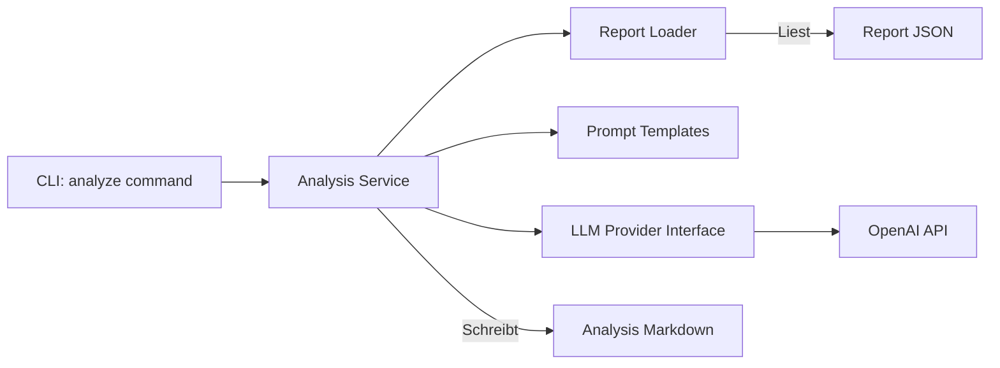

# Technical Design: Milestone M4 (KI-Analyse)

Dieses Dokument beschreibt das technische Design für die Integration der LLM-basierten Analysekomponente in `macrolens-poc`.

## 1. Architektur & Komponenten

Die Analyse-Funktionalität wird als neues Modul `macrolens_poc.llm` implementiert. Der `analyze` CLI-Befehl nutzt dieses Modul, um einen bestehenden JSON-Report zu laden, einen Prompt zu generieren und die Analyse von einem LLM-Provider (initial OpenAI) abzurufen.



## 2. Konfiguration (`config.py`)

Die `Settings`-Klasse in `src/macrolens_poc/config.py` wird um eine `LLMConfig` erweitert.

### 2.1 Neue Konfigurations-Klasse

```python
class LLMConfig(BaseModel):
    # API Key wird primär aus Environment Variable (OPENAI_API_KEY) gelesen
    # Kann optional auch hier gesetzt werden (aber nicht empfohlen für Secrets)
    api_key: Optional[str] = Field(default=None) 
    
    # Modell-Auswahl (z.B. gpt-4-turbo, gpt-3.5-turbo)
    model: str = Field(default="gpt-4-turbo")
    
    # Kreativität vs. Determinismus
    temperature: float = Field(default=0.0)
    
    # Optional: Pfad zu custom Prompts, falls der User diese überschreiben will
    # Für den PoC nutzen wir erst einmal interne Defaults.
```

### 2.2 Environment Variables (`.env`)

*   `OPENAI_API_KEY`: Der API-Key für den Provider.
*   `LLM_MODEL`: Optionaler Override für das Modell.

## 3. LLM Client Modul (`src/macrolens_poc/llm/`)

Wir kapseln die LLM-Logik sauber ab, um später andere Provider (Anthropic, Local LLMs) leicht ergänzen zu können.

### 3.1 Interface (`provider.py`)

```python
from abc import ABC, abstractmethod

class LLMProvider(ABC):
    @abstractmethod
    def generate_analysis(self, system_prompt: str, user_prompt: str) -> str:
        """
        Sendet Prompts an das LLM und gibt die Antwort als String zurück.
        Sollte Retries und Error-Handling beinhalten.
        """
        pass
```

### 3.2 Implementation (`openai_provider.py` oder in `provider.py`)

*   Nutzt die offizielle `openai` Python Library.
*   Implementiert `generate_analysis`.
*   Behandelt typische Fehler (Rate Limits, Auth Errors) via `tenacity` oder einfachem Retry-Loop (analog zu den bestehenden Retry-Utils).

### 3.3 Service (`service.py`)

```python
def analyze_report(
    settings: Settings, 
    report_data: dict, 
    provider: LLMProvider = None
) -> str:
    """
    Orchestrierungs-Funktion:
    1. Lädt Prompts (System + User).
    2. Injiziert report_data in den User-Prompt.
    3. Ruft provider.generate_analysis() auf.
    4. Gibt das Ergebnis (Markdown) zurück.
    """
    pass
```

## 4. Prompt Management

Prompts werden als Text-Dateien (Markdown) im Package abgelegt: `src/macrolens_poc/llm/prompts/`.

*   **`system.md`**: Definiert die Persona und die Regeln.
    *   *Inhalt:* "Du bist ein erfahrener Makro-Stratege. Analysiere die folgenden Marktdaten..."
*   **`user.md`**: Das Template für die eigentliche Anfrage.
    *   *Inhalt:* Enthält Platzhalter (z.B. `{{ report_json }}`) für die JSON-Daten.

**Injection:**
Für den PoC nutzen wir einfaches Python String-Formatting oder `.replace("{{ report_json }}", json_str)`, um externe Abhängigkeiten wie Jinja2 vorerst zu vermeiden, es sei denn, die Logik wird komplexer.

## 5. CLI Command (`analyze`)

Ein neuer Befehl in `src/macrolens_poc/cli.py`.

**Syntax:**
```bash
macrolens-poc analyze --report-file reports/report-20250501.json --output reports/analysis-20250501.md
```

**Ablauf:**
1.  **Load Settings**: Lädt Config inkl. LLM-Settings.
2.  **Load Report**: Liest das angegebene JSON-File.
3.  **Init Provider**: Initialisiert `OpenAIProvider` mit Key aus Env/Config.
4.  **Run Analysis**: Ruft `analyze_report` auf.
5.  **Save**: Speichert den Rückgabewert in das Output-File.
6.  **Log**: Schreibt ein strukturiertes Log-Event (`analysis_generated`).

## 6. Dependencies

*   Neu in `pyproject.toml`: `openai>=1.0.0`

## 7. Todo-Liste für Implementierung (Code Mode)

1.  `openai` Dependency hinzufügen.
2.  `Settings` in `config.py` erweitern.
3.  `src/macrolens_poc/llm/` Struktur anlegen.
4.  Prompts (`system.md`, `user.md`) erstellen.
5.  `LLMProvider` und `OpenAIProvider` implementieren.
6.  `analyze_report` Service-Logik implementieren.
7.  CLI-Command `analyze` registrieren.
8.  Tests hinzufügen (Mocking der OpenAI API).