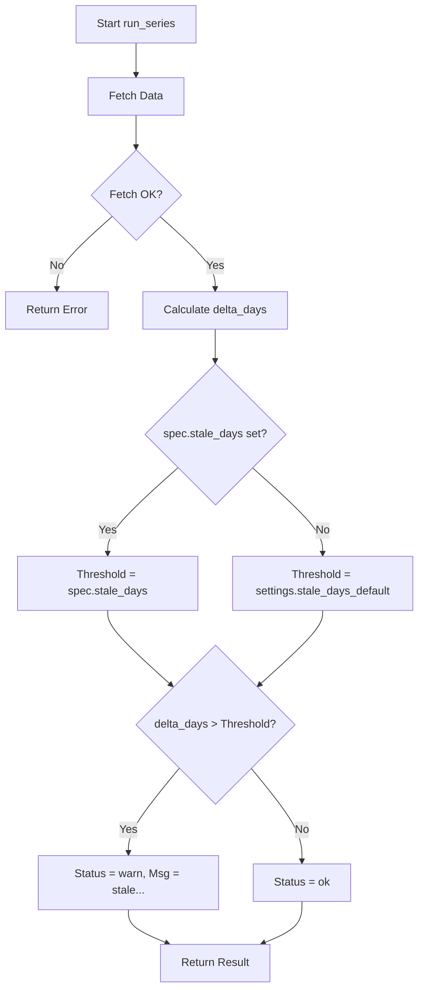

# Design: Individuelle Staleness-Schwellenwerte (stale_days)

## 1. Problemstellung
Aktuell wird für die Erkennung von veralteten Daten (Staleness) primär ein globaler Standardwert (`stale_days_default`) verwendet. Obwohl die `SeriesSpec` bereits ein Feld `stale_days` vorsieht und die Pipeline dieses nutzt, ist die Integration in das Reporting und die Konsistenz über verschiedene CLI-Befehle hinweg noch nicht vollständig explizit dokumentiert und an einer Stelle (Reporting) fehlt die Berücksichtigung des individuellen Schwellenwerts in der Anzeige.

## 2. Aktueller Stand
- **Config**: `stale_days_default` (Default: 5) in `Settings`.
- **Matrix**: `SeriesSpec` hat optionales Feld `stale_days`.
- **Pipeline**: `run_series` nutzt bereits `spec.stale_days ?? settings.stale_days_default`.
- **CLI**: `matrix-status` extrahiert Overrides manuell aus der Matrix.
- **Report**: `generate_report_v1` übernimmt den Status aus `matrix_status.json`, zeigt aber den verwendeten Schwellenwert nicht an.

## 3. Geplante Änderungen

### 3.1 Schema-Erweiterung (`config/sources_matrix.yaml`)
Hinzufügen von Beispiel-Overrides in der YAML-Datei für Serien mit geringerer Frequenz (z.B. monatliche Daten).

```yaml
  - id: us_indpro
    provider: fred
    provider_symbol: INDPRO
    # ...
    stale_days: 35  # Monatliche Daten brauchen längeren Puffer
```

### 3.2 Code-Änderungen

#### `src/macrolens_poc/sources/matrix.py`
Keine Änderungen am Code notwendig, da `stale_days` bereits in `SeriesSpec` vorhanden ist.

#### `src/macrolens_poc/report/v1.py`
Anpassung von `generate_report_v1`, um den Schwellenwert in die `SeriesRow` oder die Status-Message zu integrieren, falls die Serie als `stale` markiert ist. Dies erhöht die Transparenz im Report.

#### `src/macrolens_poc/sources/matrix_status.py`
`identify_stale_series` bleibt wie es ist, aber wir stellen sicher, dass die Logik zur Extraktion der Overrides zentraler verfügbar ist (ggf. Hilfsmethode in `SourcesMatrix`).

## 4. Technische Spezifikation

### Datenfluss
1. `load_sources_matrix` liest `stale_days` pro Serie.
2. `run_series` berechnet `delta_days`. Wenn `delta_days > (spec.stale_days or default)`, wird Status `warn` mit Nachricht `stale: ... (threshold: X)` gesetzt.
3. `merge_matrix_status` persistiert diesen Status in `matrix_status.json`.
4. `generate_report_v1` liest diesen Status und zeigt ihn in der Tabelle an.

### Mermaid Diagramm (Staleness Check)



## 5. Abnahmekriterien
- [ ] `config/sources_matrix.yaml` enthält mindestens ein Beispiel für `stale_days`.
- [ ] `run-one --id us_indpro` (mit hohem `stale_days`) resultiert in `ok`, auch wenn Daten > 5 Tage alt sind.
- [ ] Der generierte Report zeigt bei Warnungen den korrekten Schwellenwert in der Status-Spalte an.
- [ ] `tests/test_stale_detection.py` deckt den Override-Fall ab (bereits vorhanden, muss verifiziert werden).